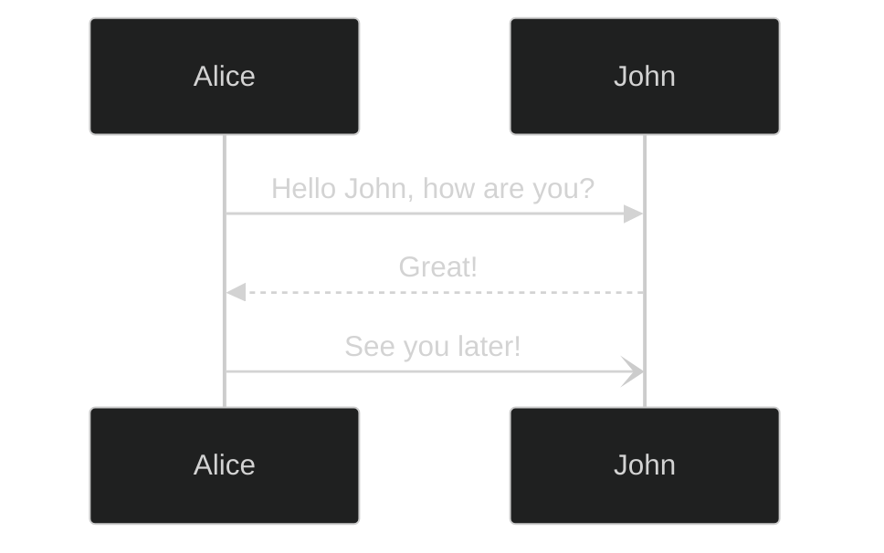

せっかくだから Mermaid も表示できるようになるといいかなと思って検索したら、ピッタリの記事を発見。ホントにありがたいですね。とりあえず記事の説明通りに進めたら、無事に表示できました。

- [Astro5.5 からは Mermaid が簡単に使えるよ](https://zenn.dev/wagomu/articles/20250315_astro_mermaid)

以下は Mermaid の公式サイトのシーケンスダイアグラムのサンプルです。



こう書くと何も問題が無かったような感じになりますが、実はローカルでは表示されていたにもかかわらず、デプロイしたら Mermaid の含まれるマークダウンが表示されないという問題が発生しました。蓋を開けてみれば答えは Mermaid の表示に必要な Playwright が GitHub 側のビルド環境に無かったというだけの話でした。サイトのビルド前に Playwright をインストールするコマンドを追加したら、無事に表示されるようになりました。

```yaml
- name: Install Playwright
  run: npx playwright install --with-deps chromium
```

そんなこんなで、Mermaid も使えるようになりました。これでまた記事の表現の幅が広がったかなと思います。
